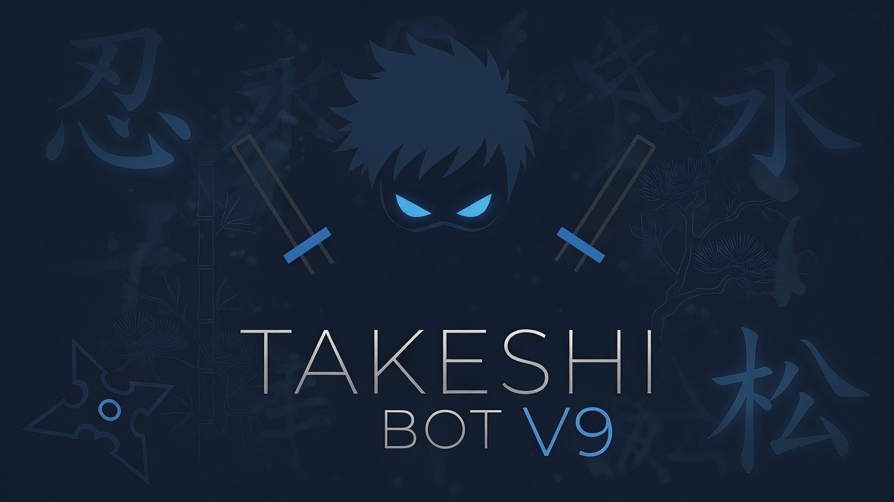
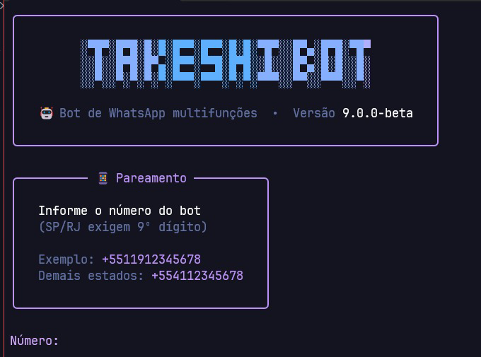
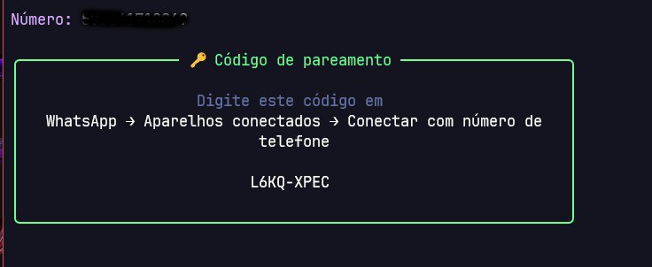
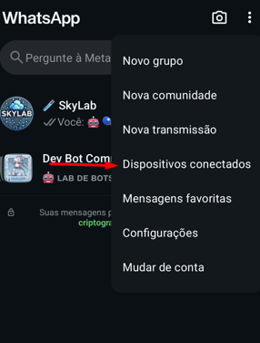
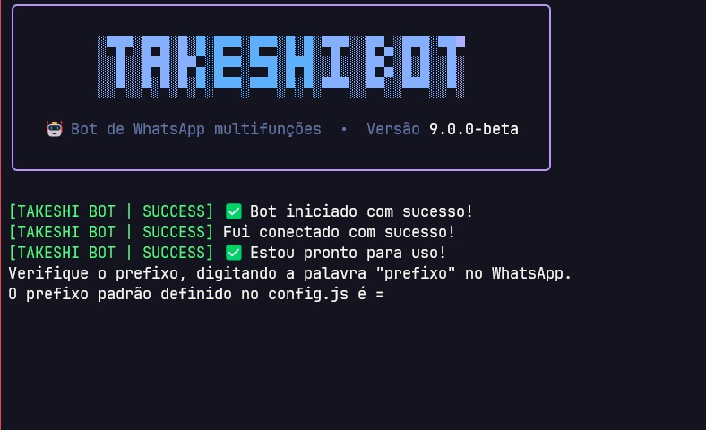
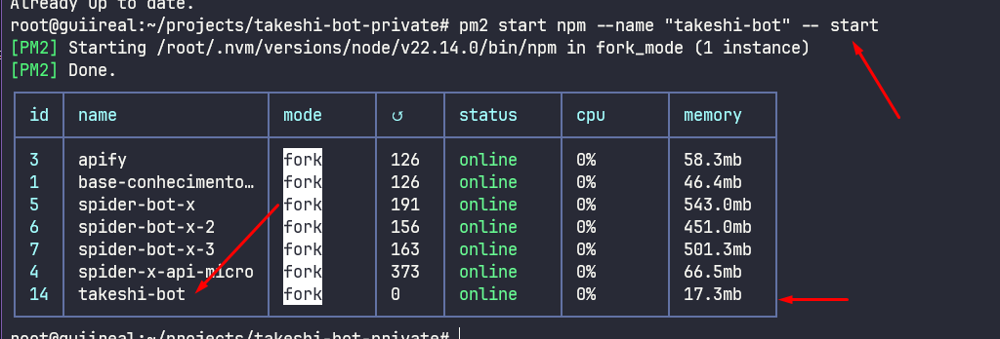
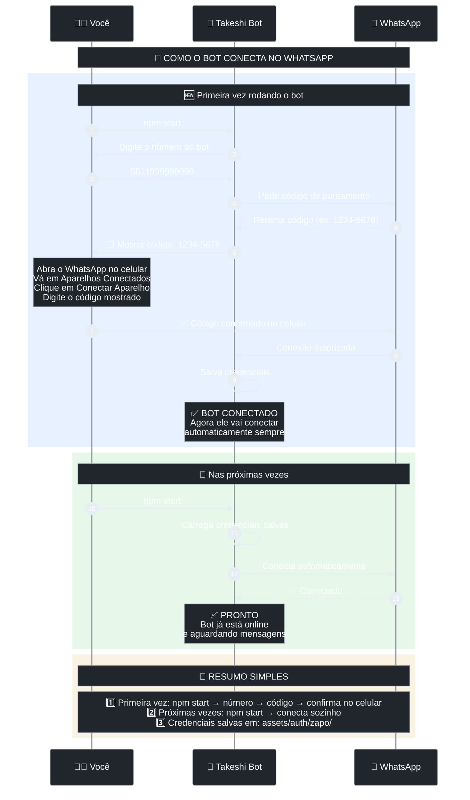
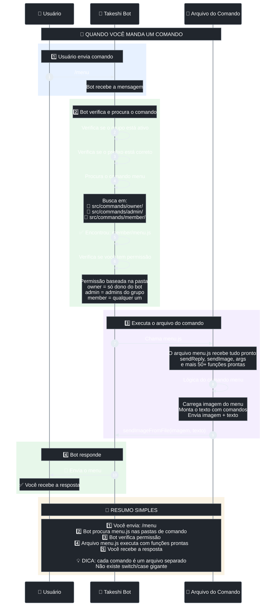
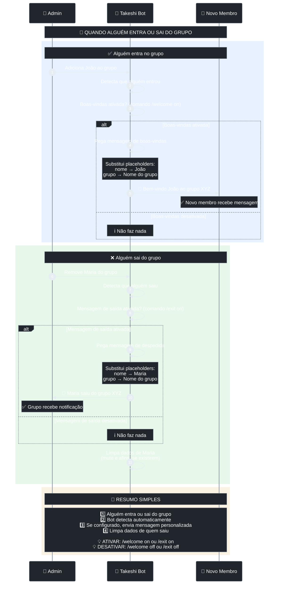
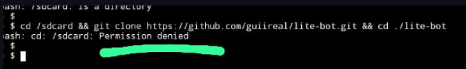

# 🤖 Takeshi Bot



[](https://github.com/guiireal/takeshi-bot)
[](https://github.com/guiireal/takeshi-bot-private/actions/workflows/test.yml)

> Base para bots de WhatsApp multifuncional com diversos comandos prontos.

[](https://nodejs.org/en)
[](https://zapo.to/)
[](https://ffmpeg.org/)
[](https://api.spiderx.com.br)

## 🧪 Testando a versão 9.0.0-beta (migração para Zapo)

Estamos migrando a base do Baileys para o [Zapo](https://zapo.to/). Se quiser testar a versão beta antes do lançamento oficial, clone a branch `9-beta`:

```sh
git clone -b 9-beta https://github.com/guiireal/takeshi-bot.git
```

Use por sua conta e risco, pode conter instabilidades.

## Desenvolvida do zero, no vídeo

[CRIANDO UM BOT DE WHATSAPP DO ZERO (GUIA DEFINITIVO) - BASE COMPLETA + 6 COMANDOS - JAVASCRIPT](https://youtu.be/6zr2NYIYIyc)


## 📋 Sumário

1. [Idiomas Disponíveis](#-acesse-o-takeshi-bot-em-outros-idiomas)
2. [Atenção](#-atenção)
3. [Sobre o Projeto](#sobre-este-projeto)
4. [Instalação](#instalação-no-termux)
    - [No Termux](#instalação-no-termux)
    - [Nas principais hosts do Brasil](#instalação-nas-principais-hosts-do-brasil)
    - [No Windows](#instalação-no-windows)
    - [Em VPS (Debian/Ubuntu)](#instalação-em-vps-debianubuntu)
5. [Diagrama de conexão](#diagrama-de-conexão)
6. [Alguns comandos necessitam de API](#alguns-comandos-necessitam-de-api)
7. [Funcionalidades](#funcionalidades-gerais)
    - [Funcionalidades gerais](#funcionalidades-gerais)
8. [Auto responder](#auto-responder)
9. [Menu do bot](#onde-fica-o-menu-do-bot)
10. [Mensagens de boas vindas](#onde-modifico-a-mensagem-de-boas-vindas-e-quando-alguém-sai-do-grupo)
11. [Diagrama de como os comandos funcionam](#diagrama-de-como-os-comandos-funcionam)
12. [Diagrama de como funcionam os middlewares](#diagrama-de-como-funcionam-os-middlewares-interceptadores-de-recepção-e-saída)
13. [Custom Middleware - Personalize o bot sem modificar arquivos principais](#custom-middleware---personalize-o-bot-sem-modificar-arquivos-principais)
14. [Estrutura de pastas](#estrutura-de-pastas)
15. [Atualizar o bot](#atualizar-o-bot)
16. [Testes](#testes)
17. [Erros comuns](#erros-comuns)
18. [Inscreva-se no canal](#inscreva-se-no-canal)
19. [Contribuindo com o projeto](#contribuindo-com-o-projeto)
20. [Licença](#licença)

## 🌐 Acesse o Takeshi Bot em outros idiomas

- 🇪🇸 [**Versión en Español**](https://github.com/guiireal/takeshi-bot-espanol)

## ⚠ Atenção

Nós não prestamos suporte gratuíto caso você tenha adquirido esta base com terceiros e tenha pago por isso.
Este bot sempre foi e sempre será **gratuíto**.
Caso você tenha pago para utilizar este bot, do jeito que ele está hoje, saiba que você **foi enganado**.
Nós não temos vínculo nenhum com terceiros e não nos responsabilizamos por isso, também não prestamos suporte nessas condições.
Os únicos recursos pagos deste bot são pertencentes à [https://api.spiderx.com.br](https://api.spiderx.com.br), nossa API oficial.

## Sobre este projeto

Este projeto não possui qualquer vínculo oficial com o WhatsApp. Ele foi desenvolvido de forma independente para interações automatizadas por meio da plataforma.

Não nos responsabilizamos por qualquer uso indevido deste bot. É de responsabilidade exclusiva do usuário garantir que sua utilização esteja em conformidade com os termos de uso do WhatsApp e a legislação vigente.

## Instalação no Termux (novo vídeo tutorial: [https://youtu.be/-yjn1Xe3ltg](https://youtu.be/-yjn1Xe3ltg))

1 - Abra o Termux e execute os comandos abaixo.
_Não tem o Termux? [Clique aqui e baixe a última versão](https://www.mediafire.com/file/wxpygdb9bcb5npb/Termux_0.118.3_Dev_Gui.apk) ou [clique aqui e baixe versão da Play Store](https://play.google.com/store/apps/details?id=com.termux) caso a versão do MediaFire anterior não funcione._

```sh
pkg upgrade -y && pkg update -y && pkg install git nodejs-lts ffmpeg python make clang binutils -y
```

> Alguns pacotes do bot (como o `better-sqlite3`, usado pra guardar a sessão do WhatsApp) precisam ser **preparados no próprio celular** no Termux. Por isso instalamos também `python`, `make`, `clang` e `binutils`, além do Node e do FFmpeg.

2 - Habilite o acesso da pasta storage, no termux.

```sh
termux-setup-storage
```

3 - Escolha uma pasta de sua preferência pra colocar os arquivos do bot.

Pastas mais utilizadas:

- /sdcard
- ~/storage/emulated/0
- ~/storage/emulated/0/Download (muito comum quando você baixa o bot pelo .zip)

No nosso exemplo, vamos para a `~/storage`

```sh
cd ~/storage
```

4 - Clone o repositório.

```sh
git clone https://github.com/guiireal/takeshi-bot.git
```

5 - Entre na pasta que foi clonada.

```sh
cd takeshi-bot
```

6 - Habilite permissões de leitura e escrita (faça apenas 1x esse passo).

```sh
chmod -R 755 ./*
```

7 - Rode este comando **antes** do `npm install` (em toda sessão nova do Termux). Sem ele, a instalação do `better-sqlite3` costuma falhar no Android:

```sh
export GYP_DEFINES="android_ndk_path=''"
```

Se quiser não digitar isso toda vez que abrir o Termux, rode **uma vez**:

```sh
mkdir -p ~/.gyp
cat > ~/.gyp/include.gypi << 'EOF'
{
  "variables": {
    "android_ndk_path": ""
  }
}
EOF
```

8 - Instale as dependências do projeto.

Na primeira vez, o Termux pode demorar **vários minutos** preparando o `better-sqlite3` no celular. Deixe terminar.

Se você escolheu uma pasta de armazenamento compartilhado (como `/sdcard`, `~/storage/emulated/0` ou a pasta `Download`), use a flag `--no-bin-links`, pois esse tipo de armazenamento não suporta links simbólicos e o `npm install` normal vai falhar:

```sh
export GYP_DEFINES="android_ndk_path=''"
npm install --no-bin-links
```

Se você usou uma pasta interna do Termux (fora da `~/storage`), pode instalar normalmente:

```sh
export GYP_DEFINES="android_ndk_path=''"
npm install
```

9 - Execute o bot.

```sh
npm start
```

10 - Insira o número de telefone e pressione `enter`.

11 - Informe o código que aparece no termux, no seu WhatsApp, [assista aqui, caso não encontre essa opção](https://youtu.be/6zr2NYIYIyc?t=5395).

12 - Aguarde 10 segundos, depois digite `CTRL + C` para parar o bot.

Depois, Configure o arquivo `config.js` que está dentro da pasta `src`.

```js
// Prefixo padrão dos comandos.
export const PREFIX = "/";

// Emoji do bot (mude se preferir).
export const BOT_EMOJI = "🤖";

// Nome do bot (mude se preferir).
export const BOT_NAME = "Takeshi Bot";

// LID do bot (no caso, o que você rodará o bot).
// Para obter o LID do bot, use o comando <prefixo>lid respondendo em cima de uma mensagem do número do bot
// Troque o <prefixo> pelo prefixo do bot (ex: /lid).
export const BOT_LID = "12345678901234567890@lid";

// LID do dono do bot (no caso, o seu!).
// Para obter o LID do dono do bot, use o comando <prefixo>meu-lid
// Troque o <prefixo> pelo prefixo do bot (ex: /meu-lid).
export const OWNER_LID = "12345678901234567890@lid";
```

13 - Inicie o bot novamente.

```sh
npm start
```

## Instalação nas principais hosts do Brasil

As principais hosts já oferecem o Takeshi como **bot padrão**, não sendo necessário nenhuma instalação manual!

**Hosts suportadas**:

| Bronxys | NexFuture | Speed Cloud |
|---------|-----------|-------------|
| [Grupo oficial](https://chat.whatsapp.com/HWeFfnUNR2mBGEw3F9GF5G) | [Grupo oficial](https://chat.whatsapp.com/Fl5FzZQC00J5CZp07AZVwQ?mode=r_c) | [Grupo oficial](https://chat.whatsapp.com/HsZDn6DJrx34z5lbNbNB2M) |
| [](https://bronxyshost.com/) | [](https://nexfuture.com.br/) | [](https://speedhosting.cloud/) |

| TED Host | Cebolinha Host | Lumina Cloud |
|----------|----------------|--------------|
| [Grupo oficial](https://chat.whatsapp.com/I4EpMkbeaxCI4z4gQ3Pdif) | [Grupo oficial](https://chat.whatsapp.com/CCf2Pw9guan12orwGg0TqC?mode=gi_t) | [Grupo oficial](https://chat.whatsapp.com/DRfvf9SfekaAAFCIR8lGbj) |
| [](https://loja.tedhost.com.br/) | []( https://dash.cebolinhahost.com) | [](https://loja.luminacloud.space/) |

| Raikken Host | LordeHost | Jexa for Developers |
|--------------|-----------|---------------------|
| [Grupo oficial](https://chat.whatsapp.com/BzSDYUHbjHGF6gQmJfh2C7?mode=gi_t) | [Grupo oficial](https://chat.whatsapp.com/JOgMrUJCMQ3BVQnIRtfTnc) | [Grupo oficial](https://chat.whatsapp.com/EDWFGZVri3gEaW2HJxK4YV) |
| [](https://painel.raikken.com.br) | [](https://lordehost.com.br) | [](https://devs.jexa.lat/) |

## Instalação no Windows

1 - Abra o PowerShell como administrador.

Clique com o botão direito no menu iniciar, escolha `Terminal (Admin)` ou `Windows PowerShell (Admin)`.

2 - Instale o Git, Node.js 22.x.x ou superior e FFmpeg.

Se você usa Windows 10 ou Windows 11 com `winget`, execute:

```sh
winget install --id Git.Git -e
winget install --id OpenJS.NodeJS -e
winget install --id Gyan.FFmpeg -e
```

Se algum comando acima não funcionar, instale manualmente:

- Git: [https://git-scm.com/downloads/win](https://git-scm.com/downloads/win)
- Node.js 22.x.x ou superior: [https://nodejs.org/en](https://nodejs.org/en)
- FFmpeg: [https://ffmpeg.org/download.html](https://ffmpeg.org/download.html)

3 - Feche e abra o PowerShell novamente para atualizar o PATH.

4 - Verifique se o Node.js, npm, Git e FFmpeg foram instalados.

```sh
node -v
npm -v
git --version
ffmpeg -version
```

O comando `node -v` deve exibir uma versão `v22.x.x` ou `v24.x.x`.

5 - Escolha uma pasta para colocar os arquivos do bot.

No exemplo abaixo, vamos usar a Área de Trabalho:

```sh
cd $env:USERPROFILE\Desktop
```

6 - Clone o repositório.

```sh
git clone https://github.com/guiireal/takeshi-bot.git
```

7 - Entre na pasta clonada.

```sh
cd takeshi-bot
```

8 - Instale as dependências.

```sh
npm install
```

9 - Execute o bot.

```sh
npm start
```

10 - Na **primeira instalação**, o bot abre um assistente no terminal:

1. **Tipo de base**
   - `1` Base limpa (só pastas `owner` / `admin` / `member` + comando `ping`)
   - `2` Base completa (com todos os comandos)
2. Se escolher a base completa:
   - Configurar **Spider X API** (`1` Sim / `2` Não) — token em [https://api.spiderx.com.br](https://api.spiderx.com.br)
   - Configurar **Linker** (`1` Sim / `2` Não) — chave em [https://linker.devgui.dev](https://linker.devgui.dev)
3. Depois disso, informe o **número do bot** para pareamento.

Digite o número **exatamente** como está no WhatsApp (com DDI).  
Não adicione o 9º dígito em números que não sejam de SP ou RJ.

Tokens e chaves ficam em `database/config.json` (também dá para mudar depois com `=set-spider-api-token` e `=set-linker-token`).

11 - Informe o **código de pareamento** (aparece em amarelo no terminal) no WhatsApp.

No WhatsApp, vá em `dispositivos conectados`, clique em `conectar dispositivo` e depois em `Conectar com número de telefone`.

12 - Aguarde a conexão. Se precisar, digite `CTRL + C` no terminal para parar o bot e ajuste `src/config.js` (nome, prefixo, LIDs, etc.).

13 - Inicie o bot novamente.

```sh
npm start
```

## Instalação em VPS (Debian/Ubuntu)

1 - Abra um novo terminal e execute os seguintes comandos.

```sh
sudo apt update && sudo apt upgrade && sudo apt-get update && sudo apt-get upgrade && sudo apt install ffmpeg
```

2 - Instale o `curl` se não tiver.

```sh
sudo apt install curl
```

3 - Instale o `git` se não tiver.

```sh
sudo apt install git
```

4 - Instale o NVM.

```sh
curl -o- https://raw.githubusercontent.com/nvm-sh/nvm/v0.40.3/install.sh | bash
```

5 - Atualize o source do seu ambiente

```sh
source ~/.bashrc
```

6 - Instale a versão 22 mais recente do node.js.

```sh
nvm install 22
```

7 - Verifique se a versão foi instalada e está ativa.

```sh
node -v # Deve exibir a versão 22
```

8 - Verifique se o npm foi instalado junto.

```sh
npm -v # Deverá exibir a versão do npm
```

9 - Instale o PM2 (recomendado).

```sh
npm install pm2 -g
```

10 - Clone o repositório do bot onde você desejar.

```sh
git clone https://github.com/guiireal/takeshi-bot.git
```

11 - Entre na pasta clonada.

```sh
cd takeshi-bot
```

12 - Instale as dependências do projeto.

```sh
npm install
```

13 - Digite o seguinte comando.

```sh
npm start
```

14 - Na **primeira instalação**, complete o assistente no terminal:

1. Base limpa (`1`) ou base completa (`2`)
2. Se base completa: configurar Spider X e Linker (opcional)
3. Número do bot para pareamento

Digite o número **exatamente** como está no WhatsApp (com DDI).  
Não adicione o 9º dígito em números que não sejam de SP ou RJ.



15 - Conecte o bot no PM2

```sh
pm2 start npm --name "takeshi-bot" -- start
```

16 - O bot exibirá um **código de pareamento** (em amarelo) que deve ser colocado em `dispositivos conectados` no seu WhatsApp.



17 - Vá em `dispositivos conectados` no seu WhatsApp.



18 - Clique em `conectar dispositivo`


19 - No canto inferior, clique em `Conectar com número de telefone`


20 - Coloque o **código de pareamento** que você recebeu no terminal, que foi feito no passo `16`.


21 - Após isso, no terminal que ficou parado, ele deve exibir que **foi conectado com sucesso**



22 - Digite `CTRL + C` para parar o bot.

23 - Agora inicie ele pelo `PM2`, executando o seguinte código abaixo.

```sh
pm2 start npm --name "takeshi-bot" -- start
```



24 - Aguarde 10 segundos, depois digite `CTRL + C` para parar o bot.

Depois, Configure o arquivo `config.js` que está dentro da pasta `src`.

```js
// Prefixo padrão dos comandos.
export const PREFIX = "/";

// Emoji do bot (mude se preferir).
export const BOT_EMOJI = "🤖";

// Nome do bot (mude se preferir).
export const BOT_NAME = "Takeshi Bot";

// LID do bot (no caso, o que você rodará o bot).
// Para obter o LID do bot, use o comando <prefixo>lid respondendo em cima de uma mensagem do número do bot
// Troque o <prefixo> pelo prefixo do bot (ex: /lid).
export const BOT_LID = "12345678901234567890@lid";

// LID do dono do bot (no caso, o seu!).
// Para obter o LID do dono do bot, use o comando <prefixo>meu-lid
// Troque o <prefixo> pelo prefixo do bot (ex: /meu-lid).
export const OWNER_LID = "12345678901234567890@lid";
```

Lembre-se de trocar os números acima pelos seus números, obviamente e tbm ver se o seu prefixo é a barra /.

25 - Por fim, teste o bot!


## Diagrama de conexão



## Alguns comandos necessitam de API

Na **primeira instalação** (base completa), o assistente já pergunta se você quer configurar Spider X e Linker.

Você também pode configurar depois:

- Pelo WhatsApp (dono): `=set-spider-api-token` e `=set-linker-token`
- Em `database/config.json` (`spider_api_token` e `linker_api_key`)
- Como fallback, em `src/config.js`:

```js
export const SPIDER_API_TOKEN = "seu_token_aqui";
export const LINKER_API_KEY = "seu_token_aqui";
```

Spider X API: [https://api.spiderx.com.br](https://api.spiderx.com.br)  
Linker (canvas / gerar-link): [https://linker.devgui.dev](https://linker.devgui.dev)

Prioridade de leitura: valor em `database/config.json` → fallback de `src/config.js`.

## Funcionalidades gerais

| Função | Contexto | Requer a Spider X API? |
| ------------ | --- | --- |
| Alterar imagem do bot | Dono | ❌ |
| Alterar token Linker | Dono | ❌ |
| Alterar token Spider X | Dono | ❌ |
| Desligar o bot no grupo | Dono | ❌ |
| Executar comandos de infra | Dono | ❌ |
| Ligar o bot no grupo | Dono | ❌ |
| Modificar o prefixo por grupo | Dono | ❌ |
| Obter o ID do grupo | Dono | ❌ |
| Abrir grupo | Admin | ❌ |
| Advertir | Admin | ❌ |
| Agendar mensagem | Admin | ❌ |
| Anti audio | Admin | ❌ |
| Anti documento | Admin | ❌ |
| Anti evento | Admin | ❌ |
| Anti ligação | Admin | ❌ |
| Anti imagem | Admin | ❌ |
| Anti link | Admin | ❌ |
| Anti lottie sticker | Admin | ❌ |
| Anti pagamento | Admin | ❌ |
| Anti produto | Admin | ❌ |
| Anti status grupo | Admin | ❌ |
| Anti sticker | Admin | ❌ |
| Anti video | Admin | ❌ |
| Banir membros | Admin | ❌ |
| Bloquear número no WhatsApp | Admin | ❌ |
| Excluir mensagens | Admin | ❌ |
| Fechar grupo | Admin | ❌ |
| Gestão de mensagens do auto-responder | Admin | ❌ |
| Ligar/desligar auto responder | Admin | ❌ |
| Definir mensagem de boas vindas | Admin | ❌ |
| Definir mensagem de saída | Admin | ❌ |
| Ligar/desligar boas vindas | Admin | ❌ |
| Ligar/desligar saída de grupo | Admin | ❌ |
| Limpar chat | Admin | ❌ |
| Marcar ausência (AFK) | Admin | ❌ |
| Marcar todos | Admin | ❌ |
| Mudar nome do grupo | Admin | ❌ |
| Mute/unmute | Admin | ❌ |
| Obter o link do grupo | Admin | ❌ |
| Reativar advertência | Admin | ❌ |
| Remover advertência | Admin | ❌ |
| Revelar | Admin | ❌ |
| Somente admins | Admin | ❌ |
| Ver saldo da Spider X API | Admin | ❌ |
| Borrar imagem | Membro | ❌ |
| Brat (imagem com texto) | Membro | ✅ |
| Bratvid (Figurinha animada no estilo brat) | Membro | ✅ |
| Busca CEP | Membro | ❌ |
| Canvas Bolsonaro | Membro | ✅ |
| Canvas cadeia | Membro | ✅ |
| Canvas inverter | Membro | ✅ |
| Canvas RIP | Membro | ✅ |
| Comandos de diversão/brincadeiras | Membro |❌ |
| Deepseek V4 Flash | Membro | ✅ |
| Envio de botões | Membro | ✅ |
| Envio de listas | Membro | ✅ |
| Espelhar imagem | Membro | ❌ |
| Facebook download | Membro | ✅ |
| Fake chat | Membro | ❌ |
| Figurinha animada para GIF | Membro | ✅ |
| Figurinha de texto animada | Membro | ✅ |
| Geração de imagens com IA | Membro | ✅ |
| Gerar link | Membro | ❌ |
| Google Gemini | Membro | ✅ |
| Google search | Membro | ✅ |
| GPT-5 Mini | Membro | ✅ |
| Imagem com contraste | Membro | ❌ |
| Imagem IA Flux | Membro | ✅ |
| Imagem pixelada | Membro | ❌ |
| Imagem preto/branco | Membro | ❌ |
| Informações de um comando | Membro | ❌ |
| Instagram download | Membro | ✅ |
| Ping | Membro | ❌ |
| Pinterest download (carrossel) | Membro | ✅ |
| Play áudio | Membro | ✅ |
| Play vídeo | Membro | ✅ |
| Renomear figurinha | Membro | ❌ |
| Remover fundo de imagem | Membro | ✅ |
| Sticker | Membro | ❌ |
| Sticker IA  | Membro | ✅ |
| Sticker para imagem | Membro | ❌ |
| TikTok audio download | Membro | ✅ |
| TikTok video download | Membro | ✅ |
| Transcrever áudio | Membro | ✅ |
| TTS (texto para áudio) | Membro | ✅ |
| X/Twitter download | Membro | ✅ |
| YT MP3 | Membro | ✅ |
| YT MP4 | Membro | ✅ |
| YT search | Membro | ✅ |

## Auto responder

O Takeshi Bot possui um auto-responder embutido, edite o arquivo em `./database/auto-responder.json`:

```json
[
    {
        "match": "Oi",
        "answer": "Olá, tudo bem?"
    },
    {
        "match": "Tudo bem",
        "answer": "Estou bem, obrigado por perguntar"
    },
    {
        "match": "Qual seu nome",
        "answer": "Meu nome é Takeshi Bot"
    }
]
```

## Onde fica o menu do bot?

O menu do bot fica dentro da pasta `src` no arquivo chamado `menu.js`

## Onde modifico a mensagem de boas vindas e quando alguém sai do grupo?

Pelo WhatsApp, com comandos de **admin** no grupo (não edite mais arquivo de código para isso):

1. Ative o recurso no grupo:
   - `=welcome 1` liga as boas-vindas
   - `=exit 1` liga a mensagem de saída
2. Defina o texto:
   - `=legendabv Seja bem vindo(a), @member!`
   - `=legendasaiu Poxa, @member saiu do grupo...`

Use `@member` na mensagem para mencionar quem entrou ou saiu.

Sem argumentos (`=legendabv` ou `=legendasaiu`), o bot mostra a mensagem atual.

As mensagens ficam salvas em `database/config.json` (`welcome_message` e `exit_message`). O padrão de fábrica já vem preenchido com texto genérico.

## Diagrama de como os comandos funcionam



## Diagrama de como funcionam os middlewares (interceptadores) de recepção e saída



## Custom Middleware - Personalize o bot sem modificar arquivos principais

O arquivo `src/middlewares/customMiddleware.js` permite adicionar lógica personalizada sem mexer nos arquivos core do bot.

### Quando usar?

- ✅ Adicionar comportamentos personalizados
- ✅ Criar logs customizados
- ✅ Implementar lógica específica por grupo
- ✅ Reagir a eventos automáticos

### Exemplos práticos

#### Exemplo 1: Reagir automaticamente a mensagens

```javascript
export async function customMiddleware({ socket, webMessage, type, commonFunctions }) {
  if (type === "message" && commonFunctions) {
    const { userMessageText } = commonFunctions;
    if (userMessageText?.toLowerCase() === "oi") {
      await socket.sendMessage(webMessage.key.remoteJid, {
        react: { text: "👋", key: webMessage.key }
      });
    }
  }
}
```

#### Exemplo 2: Log quando alguém entra no grupo

```javascript
export async function customMiddleware({ webMessage, type, action }) {
  if (type === "participant" && action === "add") {
    console.log("Novo membro:", webMessage.messageStubParameters[0]);
  }
}
```

#### Exemplo 3: Mensagem personalizada em grupo específico

```javascript
export async function customMiddleware({ type, action, commonFunctions }) {
  const grupoVIP = "120363123456789012@g.us";
  
  if (type === "participant" && action === "add" && commonFunctions?.remoteJid === grupoVIP) {
    const { sendReply } = commonFunctions;
    await sendReply("🎉 Bem-vindo ao grupo VIP!");
  }
}
```

#### Exemplo 4: Usar funções avançadas do bot

```javascript
export async function customMiddleware({ type, commonFunctions }) {
  if (type === "message" && commonFunctions) {
    const {
      sendReply,
      sendSuccessReply,
      args,
      userMessageText,
      isImage,
      downloadImage,
    } = commonFunctions;
    
    // Sua lógica personalizada aqui
  }
}
```

### Parâmetros disponíveis

| Parâmetro | Tipo | Descrição |
|-----------|------|----------|
| `socket` | Object | Socket de compatibilidade (services/wa.js) para enviar mensagens |
| `webMessage` | Object | Mensagem completa do WhatsApp |
| `type` | String | "message" ou "participant" |
| `commonFunctions` | Object/null | Todas as funções do bot (null para eventos de participantes) |
| `action` | String | "add" ou "remove" (apenas em eventos de participantes) |
| `data` | String | Dados do participante (apenas em eventos de participantes) |

## Estrutura de pastas

- 📁 .github ➔ _workflows de CI/CD e arquivo para o agente do copilot_
- 📁 assets ➔ _arquivos de mídia_
  - 📁 auth ➔ _arquivos da conexão do bot_
  - 📁 images ➔ _arquivos de imagem_
    - 📁 funny ➔ _gifs de comandos de diversão_
  - 📁 samples ➔ _arquivos de exemplo para testes_
  - 📁 temp ➔ _arquivos temporários_
- 📁 database ➔ _arquivos de dados_
- 📁 diagrams ➔ _diagramas de fluxos de dados e execução do Bot_
- 📁 node_modules ➔ _módulos do Node.js_
- 📁 scripts ➔ _scripts de apoio_
- 📁 src ➔ _código fonte do bot (geralmente você mexerá mais aqui)_
  - 📁 @types ➔ _pasta onde fica as definições de tipos_
  - 📁 commands ➔ _pasta onde ficam os comandos_
    - 📁 admin ➔ _pasta onde ficam os comandos administrativos_
    - 📁 member ➔ _pasta onde ficam os comandos gerais (todos poderão utilizar)_
      - 📁 exemplos ➔ _pasta de exemplos apenas para exploração e reaproveitamento em comandos próprios_
    - 📁 owner ➔ _pasta onde ficam os comandos de dono (grupo e bot)_
    - 📝🤖-como-criar-comandos.js ➔ _arquivo de exemplo de como criar um comando_
  - 📁 errors ➔ _classes de erros usadas nos comandos_
  - 📁 middlewares ➔ _interceptadores de requisições_
  - 📁 services ➔ _serviços diversos_
  - 📁 test ➔ _testes_
  - 📁 utils ➔ _utilitários_
  - 📝 config.js ➔ _arquivo de configurações do bot_
  - 📝 connection.js ➔ _script de conexão do bot com a zapo-js_
  - 📝 index.js ➔ _script ponto de entrada do bot_
  - 📝 loader.js ➔ _script de carga de funções_
  - 📝 menu.js ➔ _menu do bot_
  - 📝 messages.js ➔ _mensagens utilitárias (ex.: limpar chat); boas-vindas/saída ficam em database/config.json via legendabv e legendasaiu_
  - 📝 test.js ➔ _script de testes_
- 📝 .gitignore ➔ _arquivo para não subir certas pastas no GitHub_
- 📝 ⚡-cases-estao-aqui.js ➔ _easter egg_
- 📝 AGENTS.md ➔ _arquivo de instruções para IA's_
- 📝 CLAUDE.md ➔ _arquivo de instruções para a IA Claude_
- 📝 GEMINI.md ➔ _arquivo de instruções para a IA Gemini_
- 📝 CONTRIBUTING.md ➔ _guia de contribuição_
- 📝 LICENSE ➔ _arquivo de licença_
- 📝 package-lock.json ➔ _arquivo de cache das dependências do bot_
- 📝 package.json ➔ _arquivo de definição das dependências do bot_
- 📝 README.md ➔ _esta documentação_
- 📝 reset-qr-auth.sh ➔ _arquivo para excluir as credenciais do bot_
- 📝 update.sh ➔ _arquivo de atualização do bot_

## Atualizar o bot

Execute `bash update.sh`

## Testes

Execute `npm run test:all`

## Erros comuns

### 📁 Operação negada ao extrair a pasta

O erro abaixo acontece quando é feito o download do arquivo ZIP direto no celular em algumas versões do apk ZArchiver e também de celulares sem root.

Para resolver, siga o [tutorial de instalação via git clone](#instalação-no-termux).


### 🧱 `npm install` falha no Termux (better-sqlite3 / make / gyp)

Se aparecer algo como `gyp ERR!`, `make failed`, `android_ndk_path` ou erro ao instalar `better-sqlite3`, siga o fluxo abaixo. Isso acontece no Termux/Android e **não é bug do Takeshi**.

1. Instale o que falta no Termux:

```sh
pkg install python make clang binutils -y
```

2. Na **mesma** tela do Termux onde você vai rodar o `npm install`:

```sh
export GYP_DEFINES="android_ndk_path=''"
```

3. Limpe e instale de novo:

```sh
rm -rf node_modules
npm install
# se o bot estiver no /sdcard ou em Download, use:
# npm install --no-bin-links
```

Pode demorar vários minutos. Mais detalhes: [better-sqlite3#857](https://github.com/WiseLibs/better-sqlite3/issues/857) e [termux-packages#20717](https://github.com/termux/termux-packages/issues/20717).

### 🔄 Remoção dos arquivos de sessão e conectar novamente

Caso dê algum erro na conexão, digite o seguinte comando:

```sh
bash reset-qr-auth.sh
```

Depois, remova o dispositivo do WhatsApp indo nas configurações do WhatsApp em "dispositivos conectados" e repita
o procedimento de iniciar o bot com `npm start`.

### ⏱️ Erro `rate-overlimit` após muito tempo offline

Quando o bot fica muito tempo desligado (por exemplo, horas ou um dia inteiro), ao religar ele pode tentar processar muitas mensagens acumuladas de uma vez.
Isso pode disparar erro de `rate-overlimit` durante a sincronização.


Para corrigir, reinicie a autenticação do WhatsApp:

```sh
bash reset-qr-auth.sh
```

Em seguida, conecte o número novamente no WhatsApp em "dispositivos conectados".

### 🔐 Permission denied (permissão negada) ao acessar `cd /sdcard`



Abra o termux, digite `termux-setup-storage` e depois, aceite as permissões

### ⚙️ Você configura o token da Spider API, prefixo, etc e o bot não reconhece

Verifique se você não tem dois Takeshi's rodando no seu celular, muitas pessoas baixam o zip e seguem o tutorial, porém, **o tutorial não explica pelo zip, e sim, pelo git clone**.

Geralmente as pessoas que cometem esse erro, ficam com dois bots:

1. O primeiro dentro da `/sdcard`
2. O segundo na pasta `/storage/emulated/0/Download`, que no zip fica como `takeshi-bot-main`

Você deve apagar um dos bots e tanto configurar quanto executar **apenas um**

## Inscreva-se no canal

[](https://www.youtube.com/@devgui_?sub_confirmation=1)

## Contribuindo com o projeto

Contribuições estão abertas de novo: Issues e Pull Requests são bem-vindos.

O modelo é simples (título, tipo, descrição e se testou). Detalhes em [CONTRIBUTING.md](./CONTRIBUTING.md).

## Licença

[GPL-3.0](https://github.com/guiireal/takeshi-bot/blob/main/LICENSE)

Este projeto está licenciado sob a Licença Pública Geral GNU (GPL-3.0).
Isso significa que:

- Você pode usar este código como quiser, seja para projetos pessoais ou comerciais.
- Você pode modificar o código para adaptá-lo às suas necessidades.
- Você pode compartilhar ou vender o código, mesmo modificado, mas precisa:
  - Manter os créditos ao autor original (Guilherme França - Dev Gui).
  - Tornar o código modificado disponível sob a mesma licença GPL-3.0.

O que você não pode fazer:

- Não pode transformar este código em algo proprietário (fechado) e impedir outras pessoas de acessá-lo ou usá-lo.

Esta licença garante que todos tenham acesso ao código-fonte e podem colaborar livremente, promovendo o compartilhamento e o aprimoramento do projeto.
